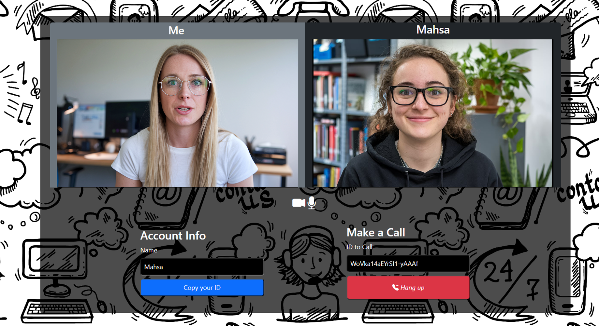

# Video Conference App

This project is a web-based video calling application built using React for the front-end and Socket.IO with Express.js for the back-end. It leverages WebRTC through the simple-peer library for peer-to-peer video communication. This project was developed during my internship at the Iran Telecommunication Research Center(ITRC).

## Table of Contents

1. [Project Overview](#project-overview)
2. [Features](#features)
3. [How It Works](#how-it-works)
4. [Frontend (React)](#frontend-react)
5. [Backend (Node.js + Express + Socket.IO)](#backend-nodejs--express--socketio)
6. [Installation and Setup](#installation-and-setup)
7. [Future Enhancements](#future-enhancements)
8. [License](#license)

## Project Overview

This application allows users to make real-time video calls using WebRTC technology, facilitated by Socket.IO for signaling and React for the user interface. Each user is assigned a unique ID for direct calling, and they can manage their call with basic functionalities like muting/unmuting audio and ending the call.



---

### Features

- Real-time video calls between users.
- Unique user IDs for making direct calls.
- Answer or reject incoming calls.
- Mute and unmute audio, and other basic call management functionality.

---

### How It Works

1. __Local Video Stream__:
   - On app startup, the user grants permission for their camera and microphone.
   - The user’s video is displayed on the screen.
2. __Making a Call__:
   - Users input a name and share their unique ID with others.
   - To initiate a call, users enter the ID of the person they want to call and press the call button.
3. __Receiving a Call__:
   - If someone calls, a notification will appear, allowing the user to answer or decline the call.
4. __Call in Progress__:
   - When a call is accepted, both users' video streams will be displayed.
   - The call can be ended by either party.

---

## Frontend (React)

- __SocketContext.js__: Manages the state for video calls and Socket.IO communication.
- __Video Component__: Displays both the local and remote video streams.
- __Options Component__: Allows the user to set a name, copy their ID, and initiate or end a call.
- __Notifications Component__: Displays incoming call notifications.
- __Styling__: The app uses custom CSS and Bootstrap for layout and UI.

---

## Backend (Node.js + Express + Socket.IO)

- __Express Server__: Serves as the HTTP server and manages WebSocket connections via Socket.IO.
- __Socket.IO__: Handles real-time communication between users for initiating and receiving calls.

### Events Handled:

- __connection__: Each client is assigned a unique socket.id upon connection.

- __calluser__: Handles call initiation between users.

- __answercall__: Handles the event when a recipient answers the call.

- __disconnect__: Handles the cleanup when a user disconnects from the server.

---

## Installation and Setup

1. Clone the repository

```sh
git clone https://github.com/ghezel1995/video-conference-app
```

---

2. Navigate to the project directory and install dependencies for both the client and server:

```sh
cd client
npm install
cd ../server
npm install
```

---

3. Start the server:

```sh
npm start
```

---

4. Start the React frontend:

```sh
cd client
npm start
```

---

5. The application will be accessible at http://localhost:3000 (for the React frontend) and http://localhost:8000 (for the backend).

---

### Future Enhancements

Here are a few features and improvements planned for future development:

1. __Group Call Functionality__
   - Allow multiple users to join a single video call.
2. __Improved UI/UX__
   - Make the user interface more mobile-responsive and enhance the overall look and feel.
3. __Call History__
   - Add functionality to store and display call logs for users.
4. __Error Handling and Notifications__
   - Implement more robust error handling (e.g., if one user disconnects, notify the other user).

---

## License

This project is licensed under the MIT License - see the [LICENSE](./LICENSE) file for details.

---

### External Links

- **React Documentation**: [React Docs](https://reactjs.org/docs/getting-started.html)
- **Socket.IO Documentation**: [Socket.IO Docs](https://socket.io/docs/v4/)
- **WebRTC Overview**: [WebRTC](https://webrtc.org/)

---

__Final Notes__

If you encounter any issues or have questions, feel free to open an issue or submit a pull request. Contributions are welcome!
